# Architecture

System overview for developers. For per-project details, see
`ARCHITECTURE.md` inside each project folder.

## 30-second tour

Polaris is an **ASP.NET Core minimal-API server** running on the
astrophotography host (RPi, mini-PC). It speaks **INDI** to local
hardware drivers, **PHD2 JSON-RPC** to the autoguider, and exposes
two things to the browser:

1. **REST endpoints** at `/api/*` for commands + queries
2. **WebSocket** streams:
   - `/ws/status` — 1Hz JSON broadcast of all service state
   - `/ws/image-stream` — binary JPEG/raw frames as they're captured

The browser runs a single **Alpine.js** SPA from `wwwroot/index.html`
that subscribes to those streams + issues commands through the REST
endpoints.

```
┌──────────────────────────────┐        ┌─────────────────────────────────┐
│  Browser (laptop/tablet/phone)│        │  Polaris host (RPi/mini-PC)    │
│  ┌──────────────────────────┐ │        │ ┌────────────────────────────┐ │
│  │ Alpine.js SPA (index.html)│ │◄──HTTP►│ │  ASP.NET Core minimal APIs │ │
│  │  - tabs: HOME/RIGS/SKY... │ │        │ │  ├ Endpoints/* (REST)      │ │
│  │  - WebSocket subscribers  │ │◄─WS────►│ │  ├ WebSocket/* handlers    │ │
│  │  - WebGL2 image renderer  │ │ status │ │  └ Services/* (business)   │ │
│  │  - Chart.js for telemetry │ │ image  │ │                            │ │
│  └──────────────────────────┘ │        │ │  Outbound to drivers:      │ │
│                              │        │ │  ├─INDI client → indiserver│ │
└──────────────────────────────┘        │ │  ├─PHD2 client → phd2 :4400│ │
                                        │ │  ├─Vendor SDKs (Canon/...) │ │
                                        │ │  └─Process.Start: ASTAP /  │ │
                                        │ │       Siril / GraXpert     │ │
                                        │ └────────────────────────────┘ │
                                        └─────────────────────────────────┘
```

## Service architecture

Services live in `src/NINA.Headless/Services/`. Every service is a
**DI singleton** unless stated otherwise. They communicate via:

- **Direct DI references** — most common, e.g. `SequenceEngine` holds
  `EquipmentManager` + `ImageRelayService` + `LiveStackingService`
- **C# events** — e.g. `ProfileService.EquipmentProfileActivated`
- **WebSocket broadcast** — services expose a `GetStatus()` /
  `CurrentStatus` and `StatusStreamHandler` reads them into the 1Hz payload

### Service dependency graph

```mermaid
flowchart TB
    subgraph Foundation
        ProfileSvc[ProfileService<br/>profile.json]
        IndiClient[IndiClient<br/>:7624]
    end

    subgraph Equipment
        EquipMgr[EquipmentManager]
        IndiClient --> EquipMgr
        ProfileSvc --> EquipMgr
    end

    subgraph Imaging
        ImageRelay[ImageRelayService<br/>/ws/image-stream]
        LiveStack[LiveStackingService]
        ImageWriter[ImageWriterService<br/>FITS/XISF]
        CameraStream[CameraStreamService]
        EquipMgr --> ImageRelay
        EquipMgr --> CameraStream
        ImageRelay --> LiveStack
        EquipMgr --> ImageWriter
    end

    subgraph Capture
        SeqEngine[SequenceEngine]
        AutoFocus[AutoFocusService]
        FlatWiz[FlatWizardService]
        EquipMgr --> SeqEngine
        ImageRelay --> SeqEngine
        EquipMgr --> AutoFocus
        ImageRelay --> AutoFocus
        EquipMgr --> FlatWiz
    end

    subgraph PHD2
        PHD2Client[PHD2Client<br/>:4400 JSON-RPC]
        PHD2Proc[PHD2ProcessManager]
        PHD2AutoStart[PHD2AutoStartService]
        PHD2Sync[PHD2ProfileSyncService]
        PHD2Cal[PHD2CalibrationOrchestrator]
        PHD2Gui[Phd2GuiSessionService<br/>xpra]
        PHD2Client --> PHD2Sync
        PHD2Client --> PHD2Cal
        ProfileSvc --> PHD2Sync
        EquipMgr --> PHD2Cal
        PHD2Client --> PHD2Proc
        PHD2Proc --> PHD2AutoStart
    end

    subgraph PlateSolving
        PlateSolve[PlateSolveService]
        SlewCenter[SlewCenterService]
        EquipMgr --> SlewCenter
        PlateSolve --> SlewCenter
    end

    subgraph Triggers
        MeridianFlip[MeridianFlipService]
        SlewPreview[SlewPreviewService]
        LiveStackTrig[LiveStackTriggersService]
        EquipMgr --> MeridianFlip
        SeqEngine --> MeridianFlip
        SlewCenter --> MeridianFlip
        EquipMgr --> SlewPreview
        CameraStream --> SlewPreview
        LiveStack --> LiveStackTrig
        AutoFocus --> LiveStackTrig
        SlewCenter --> LiveStackTrig
        PlateSolve --> LiveStackTrig
    end

    subgraph Sky
        SkyCatalog[SkyCatalogService]
        Altitude[AltitudeService]
        Geocoding[GeocodingService]
        Weather[WeatherForecastService]
        Tonight[TonightsBestService]
        SkyCatalog --> Tonight
        Altitude --> Tonight
    end

    subgraph Planetary
        SerWriter[SerFileWriter/Reader]
        VideoRec[VideoRecordingService]
        Stacker[PlanetaryStackerService]
        CameraStream --> VideoRec
        SerWriter --> VideoRec
        SerWriter --> Stacker
        PlateSolve --> Stacker
    end

    subgraph WebSocket
        StatusStream[StatusStreamHandler<br/>/ws/status @ 1Hz]
        ImageStream[ImageStreamHandler<br/>/ws/image-stream]
        EquipMgr --> StatusStream
        LiveStack --> StatusStream
        SeqEngine --> StatusStream
        PHD2Client --> StatusStream
        AutoFocus --> StatusStream
        MeridianFlip --> StatusStream
        PHD2Sync --> StatusStream
        PHD2Cal --> StatusStream
        PHD2Gui --> StatusStream
        SlewPreview --> StatusStream
        CameraStream --> StatusStream
        VideoRec --> StatusStream
        Stacker --> StatusStream
        LiveStackTrig --> StatusStream
        ImageRelay --> ImageStream
    end

    style PHD2Sync fill:#fff2cc,stroke:#d6b656
    style PHD2Cal fill:#fff2cc,stroke:#d6b656
    style PHD2Gui fill:#fff2cc,stroke:#d6b656
    style LiveStackTrig fill:#d5e8d4,stroke:#82b366
    style CameraStream fill:#dae8fc,stroke:#6c8ebf
    style VideoRec fill:#dae8fc,stroke:#6c8ebf
    style Stacker fill:#dae8fc,stroke:#6c8ebf
    style SlewPreview fill:#dae8fc,stroke:#6c8ebf
```



## Request flows

### A capture flow (sequence-driven)

```
Browser POST /api/sequence/start
    → SequenceEngine.StartAsync
    → loop per target:
        → SlewCenterService.StartJob(ra, dec) [plate solve + slew until centered]
        → loop per frame:
            → IndiCamera.CaptureAsync(exposure)
                → IndiClient sends CCD_EXPOSURE
                → INDI driver fires BLOB on completion
                → IndiBlobReceiver decodes FITS → IImageData
            → ImageWriter.SaveImage(imageData)  [persist to disk]
            → ImageRelayService.RelayImageAsync(imageData)
                → JPEG encode + send to all /ws/image-stream clients
                → if live stack on: LiveStackingService.AddFrameAsync
                    → align + accumulate + relay stacked
                    → fire FrameIntegrated event
                        → LiveStackTriggersService evaluates AF/recenter
                          gates; may block here while AF runs (60s)
            → SequenceEngine.MaybeDitherAsync(via PHD2)
            → next frame
        → next target
```

### A status update flow

`StatusStreamHandler` opens a per-client WebSocket. Once a second, in
a loop:

```csharp
var status = new {
    type = "status",
    timestamp = DateTimeOffset.UtcNow.ToUnixTimeMilliseconds(),
    equipment = equip.GetEquipmentStatus(),
    liveStack = new { isRunning, frameCount, ..., triggers = ... },
    guider = guiderPayload,  // with profileSync + calibrateJob + guiSession sub-objects
    autoFocus = autoFocusPayload,
    meridianFlip = meridianPayload,
    sequence = seqStatusPayload,
    cameraStream = ...,
    videoRecording = ...,
    videoStack = ...,
    slewPreview = ...,
    host = hostMetrics.Latest,    // CPU + RAM
    sirilJobs = ...,
    graXpertJobs = ...
};
await SendJsonAsync(ws, status);
await Task.Delay(StatusInterval);  // 1000ms
```

Every service exposes a snapshot getter (`GetStatus()` /
`CurrentStatus`) that the handler folds into this single payload.
The frontend's `handleStatusMessage` in `app.js` switch-cases the
sub-objects into Alpine state — every tab/panel binds to the same
state without polling.

### An image stream flow

`ImageStreamHandler` keeps a per-client WebSocket. `ImageRelayService`
broadcasts new frames:

```csharp
public async Task RelayImageAsync(IImageData imageData, CancellationToken ct) {
    if (Mode == JPEG) {
        var jpeg = JpegEncode(imageData);
        await BroadcastBytesAsync(jpeg);  // to every client
    } else if (Mode == RAW) {
        var raw = LZ4Compress(imageData.Data);
        await BroadcastBytesAsync(raw);
    }
}
```

Client-side `handleImageFrame` in `app.js`:

```js
ws.onmessage = (ev) => {
    if (typeof ev.data === 'string') {
        // status JSON; handled separately
    } else {
        // binary frame; render to canvas
        if (lookLikeJPEG(ev.data)) renderJpegFrame(ev.data);
        else renderRawFrame(ev.data);  // WebGL2 debayer + stretch
    }
};
```

Adaptive bandwidth (`Services/AdaptiveBandwidthService.cs`) measures
per-client latency + auto-fallback raw→JPEG when the wire is slow.

## Persistence

- **User profiles** + **rigs** in JSON: `{AppData}/Polaris/profile.json`
  via `ProfileService`. The profile holds the active rig pointer +
  the list of all rigs + their fields (devices, optics, PHD2 settings,
  LiveStackTriggers, filter offsets).
- **STUDIO frame library** in SQLite:
  `{AppData}/Polaris/studio/frames.db`. Indexed by path + filter +
  exposure + gain + type. Auto-rescan on startup.
- **Per-tenant relay state** (when running relay server): JSON file
  `tenants.json`.
- **No "session" persistence** — sequences + live stacks are in-memory
  only; restart the server and you start fresh. By design — sessions
  are tied to physical session at the telescope.

## Cross-cutting concerns

### Settings + per-rig config

`EquipmentProfile` is the single source of truth for per-rig data.
Adding a new persisted field:

1. Add the property to `EquipmentProfile`
2. Update the clone path in `ProfileService.CloneActiveRigAs`
3. Update `EquipmentEndpoints` PUT to accept it (defensive null check)
4. Update UI binding in `wwwroot/js/app.js` + `index.html`

### Event-driven coordination

Services that care about "something happened in another service" use
either:

- **C# events**: `ProfileService.EquipmentProfileActivated`,
  `PHD2Client.AppStateChanged`, `LiveStackingService.SubscribeFrameIntegrated`
- **Poll the snapshot**: less ideal but simple — most consumers do this

### Hosted services (background)

Services that need their own loop / lifetime hook implement
`IHostedService` (typically as `BackgroundService` subclass) and are
registered with `AddHostedService`:

- `PHD2AutoStartService` — boots PHD2 + connects 2s after startup
- `Phd2GuiSessionService` — boots xpra session if `AutoStart=true`
- `SlewPreviewService` — 1s poll loop for mount-slewing detection
- `HostMetricsService` — CPU + RAM sampler
- `MdnsService` — broadcasts `nina._tcp.local`
- `PluginLoaderService` — discovers MEF plugins
- `RelayClient` — maintains tunnel to relay server (when enabled)

### Long-running jobs

Pattern: orchestrator service exposes `StartJob(opts)` → returns
job id + spins a `Task.Run`. Job state is read via `GetJob(id)`
+ broadcast via WebSocket. Cancel via `Abort(id)`. Reference:
`AutoFocusService`, `PHD2CalibrationOrchestrator`,
`PlanetaryStackerService`, `SlewCenterService`,
`BatchStackingService`.

## Per-project architecture docs

Each project folder has its own `ARCHITECTURE.md` for deeper details:

- [src/NINA.Headless/ARCHITECTURE.md](src/NINA.Headless/ARCHITECTURE.md)
- [src/NINA.INDI/ARCHITECTURE.md](src/NINA.INDI/ARCHITECTURE.md)
- [src/NINA.Image.Portable/ARCHITECTURE.md](src/NINA.Image.Portable/ARCHITECTURE.md)
- [src/NINA.Camera.CanonEdsdk/ARCHITECTURE.md](src/NINA.Camera.CanonEdsdk/ARCHITECTURE.md) etc.
- [src/NINA.Relay.Server/ARCHITECTURE.md](src/NINA.Relay.Server/ARCHITECTURE.md)

## See also

- [CONTRIBUTING.md](CONTRIBUTING.md) — how to build + test + add new features
- [docs/user-guide/](docs/user-guide/) — user perspective
- Plan history: `C:\Users\danie\.claude\plans\analise-e-fa-a-um-graceful-badger.md`
  on the maintainer's machine (not in repo) — has the full multi-month
  planning record of every feature added
